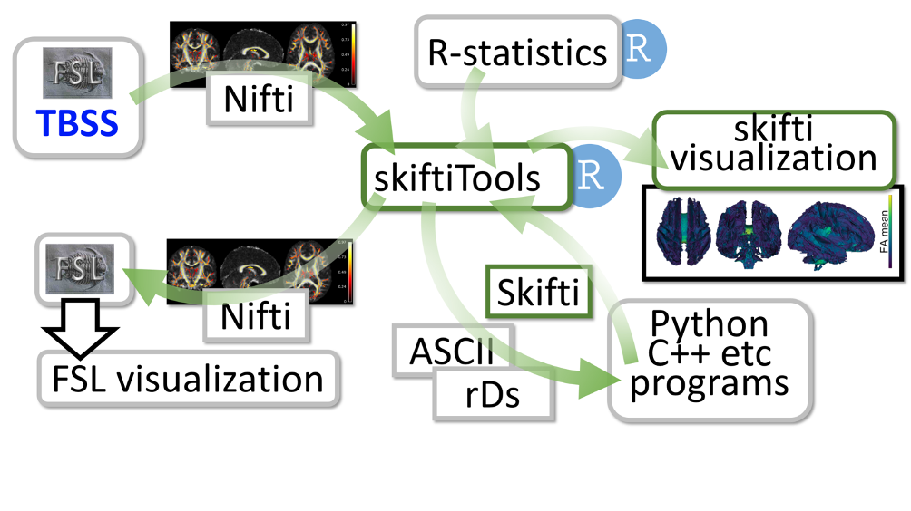

SkiftiTools analyses three and four-dimensional brain imaging data in various statistical settings. In brain image analysis, Tract-Based Spatial Statistics (TBSS) is a conventionally used tool to make statistical calculations in voxel space for brain imaging data. While they provide support for basic statistical tests needed in neuroscience, with larger datasets and more complex test settings, their use becomes cumbersome. More sophisticated statistical operations are not supported. 

SkiftiTools provides a versatile package facilitating the use of a vast amount of statistical operations in R and other tools by writing tab-separated values ASCII files, which are easily readable by most commonly used statistical tools such as R language (RStudio), SPSS, SAS, GraphPad Prism. After statistical processing, the resulting ASCII data can then be read again for visualization. The package supports Nifti image format, tab-separated ASCII format, and its own stand-alone format for efficient disk usage. 

It is open source (https://github.com/haanme/skiftiTools), built on R-language and has easy installation from R’s CRAN package repository. In addition, it has basic functions available in Docker containers for further platform independence.

.. note::

  Use of the SkiftiTools software package in published works should be accompanied by the following citation:

  **Merisaari, H., Rosberg, A., Karlsson, H., Karlsson, L., Seidlitz, J., Betlehem,    R., & Tuulari, J. (2024). skiftiTools: An R package for visualizing and manipulating skeletonized brain diffusion tensor imaging data for versatile   statistics of choice. Science Communications World Wide. doi:10.57736/87d2-0608**
