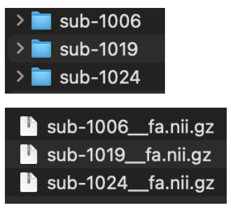
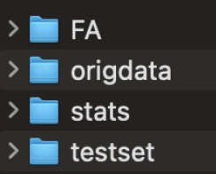
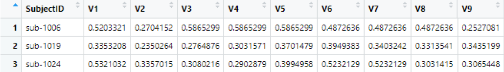
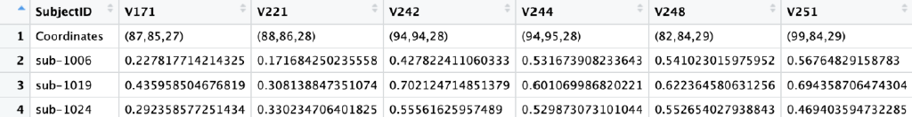
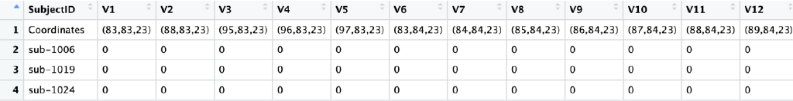

######
Usage
######

To run SkiftiTools, you must have Nifti image format or tab-separated ASCII format data. SkiftiTools is most commonly used with diffusion MRI data.

Examples
--------

A. Processing OpenNeuro DTI data using SkiftiTools v0.1.1
-----------------------------------------------------------
*******
STEP 1
*******

1.1 OpenNeuro Dataset: Download shell script under *Download with a shell script* from `OpenNeuro <https://openneuro.org/datasets/ds003900/versions/1.1.1/download#>`_

1.2 Extract the download options for 1st three items ::
	
	cat ds003900-1.1.1.sh | grep fa.nii.gz | head -3 > ds003900-1.1.1_example_for_skiftiTools.sh

Subjects that are downloaded with only their FA nifti images:

*******
STEP 2
*******

2.1 Run ANTs TBSS on the data.
For this specific example data, use the script `tractinferno_prep_ants_tbss.sh<https://github.com/HKA07/skiftiGuide/blob/main/docs/make_subjects_list.sh>` and run it in the directory it is downloaded in.

2.2 Then, run the following ``Docker`` command, but make sure that you are using memory capacity based on the machine it is running on. ANTs registration is very memory-intensive and the *antsRegistrationSyNQuick.sh* process can be force killed. It is safer to use flags with the following parameters, although it might run a little slower because of single-threaded processing:

``--cpus="1"`` 
``--memory="4g"``
``--ncpu 1``
   ::

      docker run -it --cpus="1" --memory="4g" -v $(pwd):/root/data -v $(pwd)/out_ants_tbss_enigma_ss:/root/data/out_enigma haanme/ants_tbss:0.4.2 -i /root/data/IMAGELIST_ss_docker.csv -c /root/data/CASELIST.txt --modality FA --enigma --ncpu 1 -o /root/data/out_enigma

Output in the terminal should look like this:

*******
STEP 3
*******

Check the output created by the ants_tbss ``Docker``. The out_ants_tbss_enigma_ss folder:

The most important folder is **stats**. Open it and make sure that you have the following:
   - FA_combined_roi_avg.csv
   - FA_combined_roi.csv
   - all_FA_skeletonised.nii.gz
   - mean_FA_skeleton_mask.nii.gz

If any of these files are missing, re-run the ``Docker``, or debug to see what went wrong.

*******
STEP 4
*******

4.1 You can rename the *out_ants_tbss_enigma_ss* to **tbss** to keep the directory structure clean.

4.2 Then run the following command in the directory above the **tbss** folder: 
   ::
   
      docker run --rm -v $(pwd):/data -it ashjoll/skiftitools:0.1.1 --path /data --outputpath /data/results --TBSSsubfolder tbss --scalar FA --name test

To understand what each flag is doing, you can run: 
   ::
   
      docker run --rm ashjoll/skiftitools:0.1.1 -h

The skifti data file will be in the results folder, named *test_FA_Skiftidata.txt*.

Although this file contains only 3 subjects, it can still be difficult to open in excel/numbers etc due to a lot of data. You can open it in ``R Studio`` with the following code: 
   ::

      library(data.table)

      skifti <- fread("/path/to/text/file", header = FALSE, skip = 8)

(The first few lines in the text file will have metadata that we don’t need, hence skip = 8).
   ::
      
      colnames(skifti) <- c("SubjectID", paste0("V", 1:(ncol(skifti)-1)))

The tabular data should look like this:

The picture does not display all the columns; there will be many. The V1, V2, V3... are the mean FA in each white matter ROI for each subject.

*******
STEP 5
*******

Perform any kind of complex statistical analysis using this dataset.

B. Processing OpenNeuro DTI data using SkiftiTools v0.2.0
----------------------------------------------------------
*******
STEP 1
*******

1.1 OpenNeuro Dataset:
Download shell script under *Download with a shell script* from `OpenNeuro <https://openneuro.org/datasets/ds003900/versions/1.1.1/download#>`_.

1.2 Extract the download options for 1st three items
cat ds003900-1.1.1.sh | grep fa.nii.gz | head -3 > ds003900-1.1.1_example_for_skiftiTools.sh

Subjects that are downloaded with only their FA nifti images:

*******
STEP 2
*******

Run TBSS on the data, can be FSL, ANTS etc.

*******
STEP 3
*******
Check the TBSS output

Make sure to have at least the following files in the stats folder:
::

	/stats/all_FA_skeletonised.nii.gz
	/stats/mean_FA_skeleton_mask.nii.gz

*******
STEP 4
*******

Run `make_subject_list.sh<https://github.com/HKA07/skiftiGuide/blob/main/docs/make_subjects_list.sh>` to create a text file that contains the subject IDs.

*******
STEP 5
*******

Run the docker command: ::

	docker run --rm -v /path/to/tbss/data/:/data ashjoll/skiftitools:0.2.0 --path /data --outputpath /data/results --TBSSsubfolder tbss --subjectsfile /data/subject_list.txt --scalars FA --name test --writemaskcoordinates Yes

To understand what each flag is doing, run: ::

	docker run --rm ashjoll/skiftitools:0.2.0 -h

The skifti data file will be in the results folder, named *test_FA_Skiftidata.txt*.

If you used the ``--writemaskcoordinates``, you would find a test_FA_Skiftidata_mask_coordinates.txt folder containing all the coordinates.

Although this test skiftidata file contains only 3 subjects, it can still be difficult to open in excel/numbers etc due to a lot of voxel data. You can open it in R studio with the following code: ::

	library(data.table)
	skifti <- fread("/path/to/text/file", header = FALSE, skip = 8)

(The first few lines in text file will have metadata that we don’t need, hence skip = 8). ::

	colnames(skifti) <- c("SubjectID", paste0("V", 1:(ncol(skifti)-1)))

The tabular data should look like this: 

The picture does not display all the columns; there will be many. The V1, V2, V3... are the mean FA in each white matter ROI voxels for each subject.

*******
STEP 6
*******

To integrate the coordinates text file to the skiftidata table in R:

.. note::
	
	#Coordinates for non-zero voxels#
	#Load coordinates::
	
		coords <- fread("/path/to/test_FA_Skiftidata_mask_coordinates.txt", header = FALSE)
		colnames(coords) <- c("X", "Y", "Z")

	#Find voxel columns with at least one non-zero value::
	
		voxel_cols <- colnames(skifti)[-1]
		non_zero_voxels <- voxel_cols[apply(skifti[, ..voxel_cols], 2, function(col) any(col != 0))]
	
	#Subset both data and coordinates::

		filtered_skifti <- skifti[, c("SubjectID", non_zero_voxels), with = FALSE]
		filtered_coords <- coords[match(non_zero_voxels, voxel_cols), ]

	#Create new header row with coordinates::
	
		coord_labels <- apply(filtered_coords, 1, function(row) paste0("(", row[1], ",", row[2], ",", row[3], ")"))
		header_row <- c("Coordinates", coord_labels)

	#Combine into final output: add coordinate row as a new row before data::
		
		skifti_nonzero <- rbindlist(list(as.list(header_row), filtered_skifti), use.names = FALSE, fill = TRUE)

Output table:

.. note:: 
	##Coordinates for all voxels##
	#Load full coordinates::
	
		coords_all <- fread("/path/to/test_FA_Skiftidata_mask_coordinates.txt", header = FALSE)
		colnames(coords_all) <- c("X", "Y", "Z")

	#Create coordinate labels::
		
		coord_labels_all <- apply(coords_all, 1, function(row) paste0("(", row[1], ",", row[2], ",", row[3], ")"))
		header_row_all <- c("Coordinates, coord_labels_all)

	#Combine coordinate row + subject data::

		skifti_allvox <- rbindlist(list(as.list(header_row_all), skifti), use.names = FALSE, fill = TRUE)

Output table:

*******
STEP 7
*******

Perform any kind of complex statistical analysis using this tabular data.

References
----------

[1] ENIGMA DTI Protocols: https://enigma.ini.usc.edu/protocols/dti-protocols/  

[2] ANTs TBSS Package: https://github.com/trislett/ants_tbss
